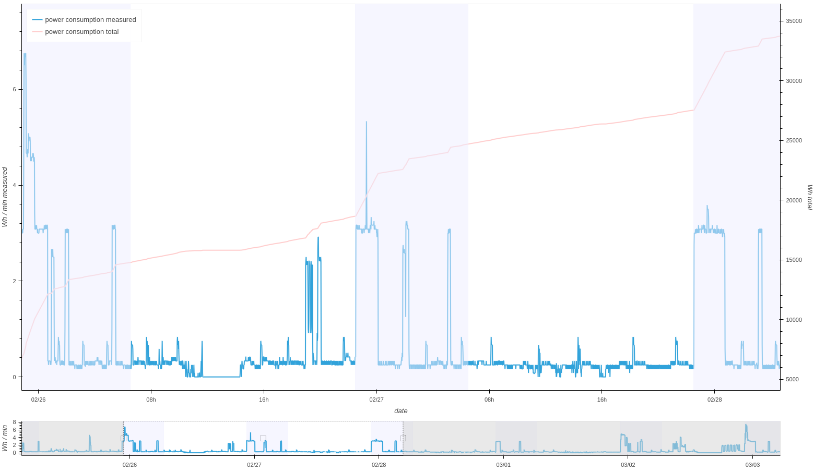
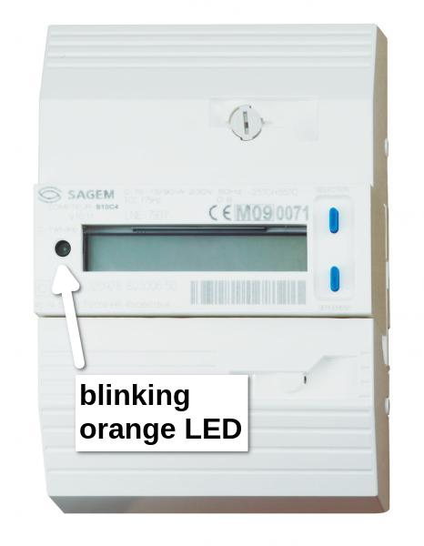
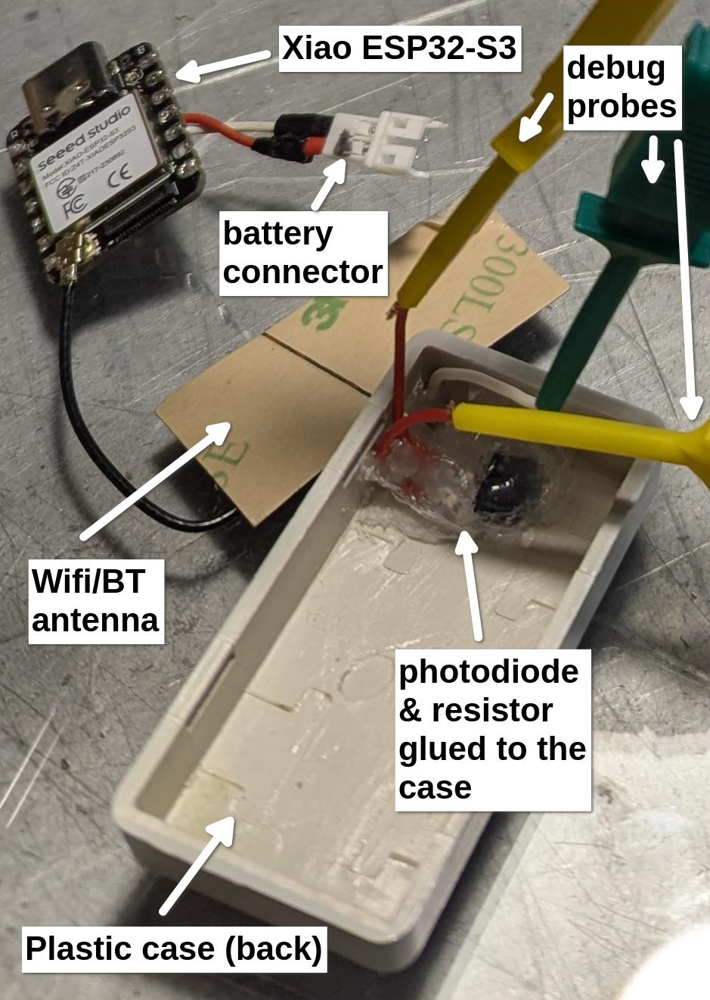
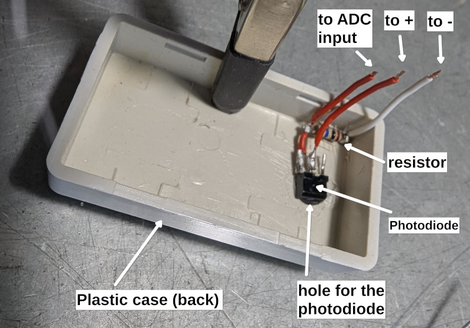

# blinkiki - report power consumption from EDF grid meter

blinkiki create graphs of your power consumption by counting the orange blink LED on your EDF grid meter, whether it is a Linky or a previous generation one (but not the rotary version).

The blinkiki sensor counts the blinks every 5 seconds and reports the count over Wifi or Bluetooth to a server running on a PC.
The server provides power consumption graphs and logs to a web browser.



Components:
* [sensor hardware](#sensor-hardware)
* [sensor firmware](#sensor-firmware)
* [server software](#server)

The EDF grid meter blinks:
- The orange LED on EDF meter flashes every Wh passing through it.
- The flashes are around 40ms long.


# Sensor Hardware

Items list:
- 1x Seeed Xiao esp32-s3 board, based on ESP32-S3 MCU
- OR a Adafruit Trinket M0, based on Atmel ATSAMD21 ARM Cortex M0+
- 1x Photodiode, can be found in old computer mouse
- 1x resistor, resistance depending on your photodiode
- 1x lipo battery
- 1x "small" plastic case



Mounting together:
- a drill to make a hole in the plastic case for the photodiode
- hot glue to attach the electronics to the case



General principle:
- Our sensor will detect the grid meter LED blinks using a photodiode. The resistance of the photodiode will vary depending on the level of light. We apply 3.3V on to the photodiode, and put a resistor in serial with it. By measuring the current at the resistor pins using the ADC of an MCU, we can observe the variations of resistance of the photodiode.
- Daylight will probably influence the measurements, possibly even blinding the sensor and making measurements impossible. It is then important to insolate the couple sensor + meter LED from daylight, for example using thick black tape. Open question: It may be possible to pick a photodiode that only reacts to the wavelenght of the blinking LED ?

# Sensor firmware

The sensor firmware is based on Zephyr RTOS. The code is located in [`sensor_fw/`](sensor_fw/) directory.

It uses [MCUboot](https://docs.zephyrproject.org/latest/services/device_mgmt/dfu.html#mcuboot) to allow firmware management [over Wifi](#maintenance) and [over Bluetooth](#maintenance) using the [Simple Management Protocol](https://docs.zephyrproject.org/latest/services/device_mgmt/mcumgr.html).

Sensor firmware files overview:
- [main.c](sensor_fw/main.c) - source code for the sensor
- [prj.conf](sensor_fw/prj.conf) - configuration options of the node
- [Makefile](sensor_fw/Makefile) - mainly wrapper `make` commands around Zephyr `west` commands
- [Kconfig](sensor_fw/Kconfig) - definition of the configuration options of the node
- [CMakeLists.txt](sensor_fw/CMakeLists.txt) - build rules for the firmware
- [boards/](sensor_fw/boards) - directory containing the Device Tree overlays for the target hardware / simulator
- [conf/](sensor_fw/conf) - directoring containing the configuration options depending on the build type (`DEBUG=1`) and transport mode (eg. `TRANS=wifi`)

See [Internals](#internals) for more details.

## Configuration

The number of blinks counted every 5 seconds are reported back to the server. 10 past measurements are included in each report by default.

The firmware supports 2 transport modes, configurable at build time with `make` and `TRANS=wifi` (default) or `TRANS=bt`:
- Wifi, where the sensor will connect to a local Wifi network to report it's last 10 measurements.
- Bluetooth, where the sensor will update the Bluetooth advertisement manufacturer data every 5 seconds to include the 10 last measurements. Bluetooth PHY can be set to Coded PHY to extend the range by using [`CONFIG_BKK_BT_CODED_PHY=y`](sensor_fw/prj.conf). See also [Bluetooth mode notes](#Bluetooth mode notes) to set tx power to the maximum.

Check out the [Kconfig](sensor_fw/Kconfig) configuration definitions and adapt your [prj.conf](sensor_fw/prj.conf) settings accordingly:
```
comment "sensor settings"
config BKK_SENSOR_TYPE
	hex "Type of the sensor"
config BKK_PULSE_STORE_COUNT
	int "Number of 5 seconds events to store"
config BKK_BLINK
	bool "Blink LED"

comment "Bluetooth settings"
config BKK_BT_CODED_PHY
	bool "Use Bluetooth Coded PHY"
config BKK_BT_REPORT_FAST
	bool "Use fast advertisement (100ms) instead of slow (1s)"

comment "Wifi settings"
config BKK_WIFI_SSID
	string "wifi SSID"
config BKK_WIFI_SECURITY
	int "0: open, 1: wpa2-psk, 11: wpa-psk, see net/wifi.h"
config BKK_WIFI_PSK
	string "PSK"
config BKK_WIFI_SERVER_ADDR
	string "server IPv4 address"
config BKK_WIFI_SERVER_PORT
	int "server port"
config BKK_WIFI_REPORT_INTERVAL
	int "interval in seconds to report values"
```

## Building & flashing

You can use `make` commands (see [Makefile](sensor_fw/Makefile)) as a wrapper around Zephyr `west` commands. List the available targets using `make` without targets from the `sensor_fw/` directory.

### Xiao ESP32-S3

- with Wifi network transport
```
# build
make esp DEBUG=1

# flash bootloader (needed only once) over USB
make esp-mcuboot-flash
# flash firmware over USB
make flash
```

### Local simulator

A simulated ADC will be used to feed the light measurement data.

- with simulated network transport
```
# build
make sim DEBUG=1

# run (as root if you want to allow Zephyr to create tuntap device)
sudo make sim-run
# setup host network (execute after sim-run)
make sim-setup-net
```

- with bluetooth transport
```
# build
make sim DEBUG=1 TRANS=bt

# run using host bluetooth hardware
make sim-run-bt
```

### Adafruit trinket-m0

```
make m0 DEBUG=1
make flash
```

## Debugging

- shell console through USB

```
make cons
```

- shell console through Wifi / local network
```
telnet XXX.XXX.XXX.XXX
```

- shell console through Bluetooth (over [NUS](https://docs.nordicsemi.com/bundle/ncs-latest/page/nrf/libraries/bluetooth/services/nus.html))

```
make bt-cons MAC=XX:XX:XX:XX:XX:XX
```

- analyse coredump

Compile with `DEBUG=1`, then use `make esp-gdb-cons` to extract the core dump from the serial trace and fire-up gdb on it.

see [Zephyr coedump documentation](https://docs.zephyrproject.org/latest/services/debugging/coredump.html) for details.

## Maintenance

Bellow targets are using [smpmgr](https://github.com/intercreate/smpmgr/) client built over [smpclient](https://github.com/intercreate/smpclient) python library.

Alternatively you could try the `smp-tool` from [smp-rs](https://github.com/Gessler-GmbH/smp-rs/)

- firmware update over Wifi

```
make wifi-flash IP=XXX.XXX.XXX.XXX
```

- firmware update over Bluetooth

```
make bt-flash MAC=XX:XX:XX:XX:XX:XX
```

## Internals of the firmware

main function:
- set-up the board: ADC, GPIOs (optional blink), start transport wifi / bluetooth
- spawns a timer called "light"
- main loop
  - wait message from "light" timer
  - detect peaks in the last 5 seconds buffer
    - reads a window of 5 measurements
    - detect peaks in this window
  - report the number of peaks over wifi / bluetooth 

"light" timer:
- called every 25ms
- read one ADC value and adds it to a 5 seconds buffer
- if 5 seconds buffer is full, sends an IPC message to main and switch to other buffer

Power consumption of the sensor is not optimised.

## Bluetooth mode notes

- patch to Zephyr espressif HAL to use maximum power (2024-12)

```
diff --git a/zephyr/esp32s3/include/bt/esp_bt.h b/zephyr/esp32s3/include/bt/esp_bt.h
index f6e6a33be3..60f114a940 100644
--- a/zephyr/esp32s3/include/bt/esp_bt.h
+++ b/zephyr/esp32s3/include/bt/esp_bt.h
@@ -57,7 +57,10 @@ extern "C" {
 #define ESP32_RADIO_TXP_DEFAULT ESP_PWR_LVL_N24
 #else
 /* use 0dB TX power as default */
-#define ESP32_RADIO_TXP_DEFAULT ESP_PWR_LVL_N0
+//#define ESP32_RADIO_TXP_DEFAULT ESP_PWR_LVL_N0
+//#define ESP32_RADIO_TXP_DEFAULT ESP_PWR_LVL_N0 // LG ~60
+//#define ESP32_RADIO_TXP_DEFAULT ESP_PWR_LVL_P9 // LG ~50
+#define ESP32_RADIO_TXP_DEFAULT ESP_PWR_LVL_P21 // LG ~40
 #endif
 
 /**
```

# Server

The server is using python 3, [fastapi](https://fastapi.tiangolo.com/) and [holoviews](https://holoviews.org/) to provide interactive graphs of the data.

The code is located in [`server/`](server/) directory.

## Install requirements

pip install -r requirements.txt

## run the server
The server can be accessed on port `8087`
```
./server.py
```

run a read-only instance on a different port (statistics-only, does not accept reports from sensor)
```
./server.py -r -p 8088
```

## access the server

- statistics page:

[http://IP:8087/stats](http://10.9.9.1:8087/stats)

The top part is a zoomable graph of the power consumption (up to 5 seconds resolution). Zoom with the mouse wheel, pan by dragging.

The bottom part is a "minimap" overview of all the measurements, displaying the location where top part is currently focused. 


# Similar devices

- OTMetric - Bubble UP (commercial)
https://cdn.store-factory.com/www.compteur-energie.com/media/FT-OPTIC-EDF-169-MHz-2023.pdf
https://cdn.store-factory.com/www.compteur-energie.com/media/Notice-technique-OPTIC-EDF.pdf
